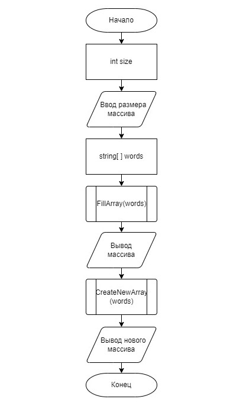

# Контрольная работа (Итоговая контрольная работа по основному блоку)

## *Задание*

Написать программу, которая из имеющегося массива строк формирует новый массив из строк, длина которых меньше, либо равна 3 символам. Первоначальный массив можно ввести с клавиатуры, либо задать на старте выполнения алгоритма. При решении не рекомендуется пользоваться коллекциями, лучше обойтись исключительно массивами.

## *Описание алгоритма программы*

Изначально программа запрашивает у пользователя ввод размера массива строк, т.е. какое количество строк будет содежать массив. Далее инициальзируется массив такого размера. Затем с помощью метода FillArray пользователь вручную вводит каждый элемент массива, другими словами каждую строку. После ввода всех элементов, на консоль выводится заполненный массив строк. Мгновенно срабатывает метод, вычисляющий количество подходящих под условие задачи элементов массива, и создает новый массив определенного размера, который впоследствие заполняется подходящими строками из старого массива. Также предусмотрен случай, когда в старом массиве ни один элемент не удовлетворяет условию заполнения второго массива. В этом случае метод возвращает строку *"нет подходящих строк в веденном массиве"*.

## *Блок-схема алгоритма*

